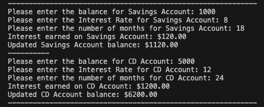

# Customer Banking System

## Author
**Asif Khan**

## Description

The Customer Banking System is an application that simulates banking operations such as creating and managing savings and Certificate of Deposit (CD) accounts. Users can input their initial balances, interest rates, and the duration of their deposits, and the system will calculate the interest earned and update the account balances accordingly.

## Features

- **Account Management**: Supports creating and managing both Savings and CD accounts.
- **Interest Calculation**: Calculates interest based on user-defined interest rates and durations.
- **Balance Updates**: Automatically updates account balances with the earned interest.
- **User Interaction**: Provides a simple user interface for inputting account details and viewing results.

## File Structure

- **`Accounts.py`**: Defines the `Account` class, which includes methods to set and get the account balance and interest.
- **`saving_account.py`**: Contains the `create_savings_account` function, which calculates the interest for a savings account and updates the balance.
- **`cd_account.py`**: Contains the `create_cd_account` function, which calculates the interest for a CD account and updates the balance.
- **`customer_banking.py`**: The main program file that interacts with the user, gathers input, and uses the functions from `saving_account.py` and `cd_account.py` to process account information.

## How It Works

1. **Account Creation**:
   - Users are prompted to enter the balance, interest rate, and duration for both savings and CD accounts.
   - The system then calculates the interest earned and updates the balances accordingly.

2. **Interest Calculation**:
   - Interest is calculated using the formula:
     interest = balance * (apr/100 * months/12)

3. **Balance Update**:
   - After calculating the interest, the system updates the balance of the account to reflect the new total.

4. **User Feedback**:
   - The program outputs the interest earned and the updated balance for both the savings and CD accounts.

## Customer Banking System Demo

## Future Improvements
- Exception handling when a user enters invalid inputs (like alphabets)
- adding more banking functionalities

## Challenge Instructions
### Create the Savings Account Function:

Open the savings_account.py file, and do the following:
1. Imports the Account class from the Accounts.py file.
2. In the create_savings_account function do the following:
- Create an instance of the Account class and pass in the balance and interest parameters.
- Calculate interest earned.
Interest on the balance is calculated as follows: interest = balance * (apr/100 * months/12).
- Update the savings account balance by adding the interest earned.
You will need to use 0 for the amount of interest to set the balance before you pass the interest earned to the set interest method.
- Pass the updated balance to the set balance method using the instance of the Account class.
- Pass the interest earned to the set interest method using the instance of the Account class.
- Return the updated balance and interest earned.

### Create the CD Account Function:
Open the cd_account.py file, and do the following:
1. Import the Account class from the Accounts.py file.
2. In the create_cd_account function, do the following:
- Create an instance of the Account class and pass in the parameters.
- Calculate interest earned.
- Update the savings account balance by adding the interest earned.
You will need to use 0 for the amount of interest to set the balance before you pass the interest earned to the set interest method.
- Pass the updated balance to the set balance method using the instance of the Account class.
- Pass the interest earned to the set interest method using the instance of the Account class.
- Return the updated balance and interest earned.

### Create the Main Function:
Open the customer_banking.py file, and do the following:
1. Import the create_cd_account and create_savings_account functions from the appropriate files.
2. In the main function, do the following:
- Prompt the user to set the savings balance, interest rate, and months for the savings account.
Make sure that the values are the appropriate data types.
- Call the create_savings_account function and pass in the variables from the user.
• Print out the interest earned and updated savings account balance with interest earned for the given months.
- Prompt the user to set the CD balance, interest rate, and months for the CD account.
Make sure that the values are the appropriate data types.
- Call the create_cd_account function and pass the variables to the function used to prompt the user from the user.
- Print out the interest earned and updated CD account balance with interest earned for the given months.
- Call the main function.

